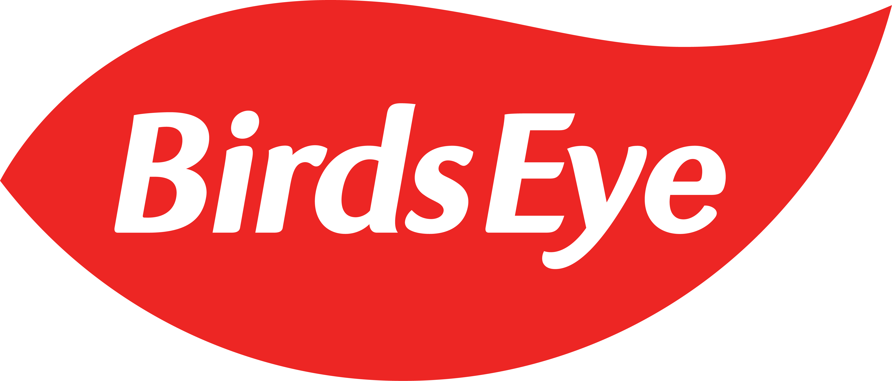
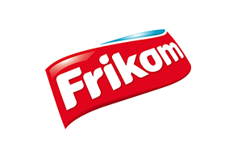
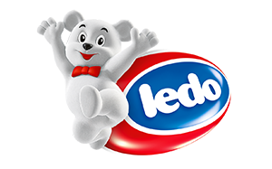
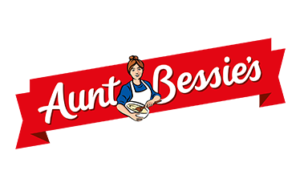
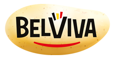

## Negocio

Producción y distribución a mayoristas de alimentos congelados

### Marcas

|  logo 	|  marca 	|  mercados 	|
|---	|---	|---	|---	|
|   	|  Birds Eye 	| Ireland, United Kingdom 	|
|   	| Findus  	| Finland, France, Italy, Norway, Spain, Sweden, Switzerland 	|
|   	|  iglo 	|Austria, Belgium, Germany, Netherlands, Portugal  	|
|  Frikom 	|   	| Serbia  	|
|   	| Ledo  	| Croatia  	|
|   	|  Aunt Bessie’s 	| United Kingdom  	|
|   	| Goodfella’s  	| Ireland, United Kingdom  	|
|   	| La Cocinera  	| Spain  	|
|   	| Belviva  	| Belgium  	|

## Fundamentales

## Insiders

## Historia

## Negocio

### Comportamiento en crisis

### Adquisiciones

## Sector

