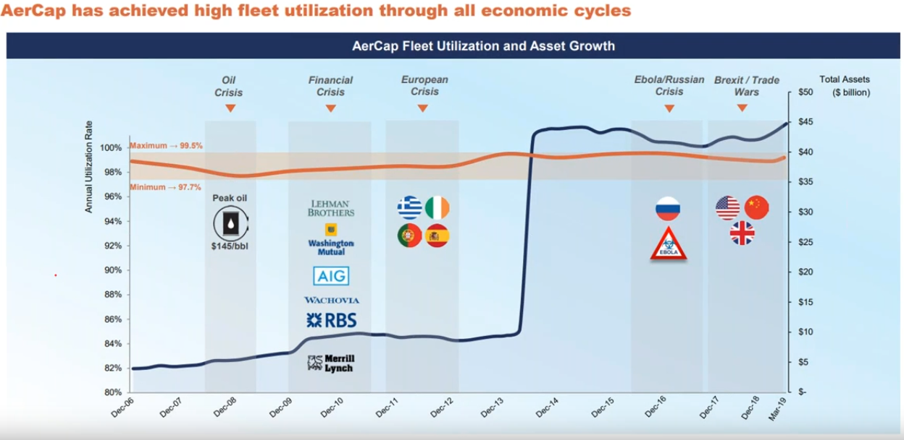

## RESUMEN
- Leasing de aviones comerciales
- Excelente equipo gestor
- Sector en crecimeinto
- Empresa esrtable
- PER 8x en 2024
- P/B 0.9x

## NEGOCIO
### MODELO DE NEGOCIO
Se considera una empresa financiera y se basa en el "*SPREAD*. 

Tiene la ventaja con respecto a otro tipo de empresas financieras, que puede controlar la duración de sus activos y pasivos, por lo que es más fácil la optimización.

#### Segmentos: Productos y servicios
- Alquiler jets provados
- Alquiler helicópteros
- Alquiler aviones regionales
- Alquiler aviones de >120 pasajeros

#### Activos y capital
#### Mercado y Clientela
#### Insiders
- El CEO fundó la empresa -> sabe lo que hace 
- El quipo directivo posee 150M€ en acciones

### GENERACION VALOR
#### Expansión ventas y márgenes
#### Adquisiciones
#### Recompra acciones
- Desde 2015 recompra de acciones agresiva (tras adquisición de ILFC)
#### Dividendos
- Actualmente, 2024, tiene un dividendo de 1€/acción (1% yield)
#### Deuda
#### OPEX
#### CAPEX

### PREDICTIBILIDAD
#### Ciclicidad
#### Comportamiento en crisis
- Desde el punto de vista del uso de los activos, parece que las crisis no le afectan demasiado.
- Los revenues se ven afectados por las crisis, pero como tienen contratos con las aerolíneas sus ventas no se ven afectadas inmediatamente. Lo que si les afecta son los ingresos de las ventas de activos mas antiguos.
-Los intereses se reducen en tiempos de crisis? lo que reduce los gastos, mitigando parcialmente el efecto de la reducción de ingresos.
- El precio de las acciones si se ve afectado.

## SECTOR
Ver info mas detallada en el análisis del [transporte aéreo comercial](../sectors/commercial-flights.md)

### Expansión mercado
- 4.5% anual (CAGR)

### Ciclicidad mercado
### Sensibilidad mercado
### Fragmentación
### Competencia
- Airlease
### Riesgos y oportunidades sector

- Ventaja competitiva de estar siempre comprando aviones -> preferente en las listas de los fabricantes. A las compañías a veces les resulta complicado conseguir aviones porque los fabricantes ajustan mucho la producción a la demanda y los tiempos de espera/entrega son elevados.

- La tendencia del mercado es a que las compañías cada vez alquilen mas aviones y compren menos.

- Escala
    - Logra una alta eficiencia en el uso de los activos de la compañía

    - Coste de la deuda relativamente barato (High Investment Grade de BBB+ [S&P Global](https://disclosure.spglobal.com/ratings/en/regulatory/article/-/view/type/HTML/id/3202628), [Fitch](https://www.fitchratings.com/entity/aercap-holdings-nv-88041757#ratings), [resumen](https://www.aercap.com/investors/fixed-income-investors))
    - Dada su poca sensibilidad tiene acceso a deuda incluso en épocas de crisis
    - Facilidad para la compra de nuevos aviones 
    - La flota tiene una buena calidad porque continuamente están rotando sus activos.
- Equipo directivo

## ANÁLISIS
### DAFO
### Valoración 

## ESTRATEGIA INVERSIÓN

